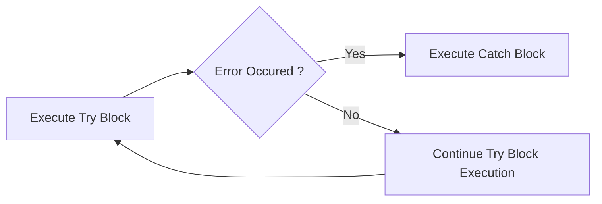

# Gérer les erreurs

En Powershell, il existe deux types d'erreur:

`Non-Terminating`
:    Une erreur est émise mais le reste du code continu à s'éxécuter.

`Terminating`
:   Une erreur sera émise et l'éxécution du code sera arrété immédiatement.

La variable `$ErrorActionPreference` et le paramètre `-ErrorAction` permettent de changer le comportement de votre code en cas d'erreur `Non-Terminating`. Ils peuvent prendre les valeurs suivantes :

Continue
:   Emet une erreur et continue l'exécution (valeur par défaut)

SilentlyContinue
:   N'émet aucun message d'erreur et continue l'éxécution. Impossible à "catcher" dans le code.

Ignore
:   Supprime le message et continue l'éxécution. Dans le cas de `-ErrorActionPreference`, n'alimente pas la variable `$Error`. Impossible à "catcher" dans le code.

Inquire
:   Emet un message d'erreur et demande confirmation avant de continuer l'éxécution.

Stop
:   Affiche le message et stoppe l'éxécution.  **C'est ce comportement que nous pourrons catcher dans le code**.


!!!warning
Supprimer l'ensemble des erreurs dans son script en configurant `$ErrorActionPreference = "SilentlyContinue"` au début de son script est une mauvaise habitude à ne pas prendre.
!!!

Dans le cas où nous configurons `ErrorAction = Stop`, nous indiquons à Powershell de stopper toute éxécution en cas d'erreur. Dans le cas d'une boucle, une seule erreur dans celle ci, arretera toute les itérations de la boucle.

Dans cette exemple, si une seule machine est injoignable via la commande `Get-CimInstance`, **la boucle ne renverra rien** :

```powershell #8
foreach ($computer in $Computername)
{
    Write-Verbose "Querying $($computer.toUpper())"

    $params = @{
        Classname    = 'Win32_OperatingSystem'
        Computername = $computer
        ErrorAction  = 'Stop'
    }

    Get-CimInstance @params
}
```

## Try / Catch

Pour gérer et catcher les erreurs `Terminating`, il convient de les utiliser au sein d'un block `Try/Catch`

+++ :icon-code: Code

```powershell #13-18
$ComputerName = "OfflineComputer","WKS02"

foreach ($computer in $Computername)
{
    Write-Verbose "Querying $($computer.toUpper())"

    $params = @{
        Classname    = 'Win32_OperatingSystem'
        Computername = $computer
        ErrorAction  = 'Stop'
    }

    try {
        Get-CimInstance @params
    }
    catch {
        Write-Warning " A problme occured when querying computer: $computer"
    }
}
```

+++ :icon-note: Output

```txt
WARNING:  A problme occured when querying computer: OfflineComputer

SystemDirectory     Organization BuildNumber RegisteredUser   SerialNumber            Version    PSComputerName
---------------     ------------ ----------- --------------   ------------            -------    --------------
C:\Windows\system32              22631       User01           00330-50181-42672-AAOEM 10.0.22631 WKS02
```

+++



!!!
Dans un bloc `catch`, la variable [!badge variant="danger" text="$_"] correspondra au message de l'erreur qui a déclenchée son exécution
!!!

### Catcher par type d'exception

Il est possible de renseigner plusieur block `catch` en définisant à chacun le type d'exception qui les déclencheras.

Ici, cela nous permettra, par exemple, de définir si la suppression d'un fichier a échoué parce que le fichier est déja supprimé ou bien parce que nous n'avons pas les droits de le supprimer :

+++ :icon-code: Code
```powershell
$FilesToRemove = 'c:\notexist.txt', 'C:\hiberfil.sys'

foreach ($File in $FilesToRemove)
{
    Try
    {
        Write-Verbose "Remove $File" -Verbose
        Remove-Item $File -ErrorAction Stop
    }
    Catch [System.Management.Automation.ItemNotFoundException]
    {
        Write-Warning 'Le Fichier est introuvable'

    }
    Catch [System.IO.IOException]
    {
        Write-Warning "Vous n'avez pas les droits pour supprimer ce fichier"
    }
    Catch
    {
        Write-Warning 'Une erreur inconnue a été rencontrée'
    }
}
```

+++ :icon-note: Output

```txt
VERBOSE: Remove c:\notexist.txt
WARNING: Le Fichier est introuvable
VERBOSE: Remove C:\hiberfil.sys
WARNING: Vous n'avez pas les droits pour supprimer ce fichier
```

+++

!!! Pour identifier le type d'une exception:

Juste aprés avoir rencontré l'erreur, éxécuter :

```powershell
$Error[0].exception.GetType().fullname
```

**Pour rappel:** [!badge variant="danger" text="$Error"] contient toutes les erreurs de la session, de la plus récente à la plus ancienne. `$Error[0]` renvoie donc la dernière erreur rencontrée.
!!!

## Bloc Finally

Il est possible d'ajouter à un `Try/Catch` le bloc `Finally`. Celui-ci s'éxécutera à la fin du Try\Catch, que des erreurs aient été rencontrées ou non.
