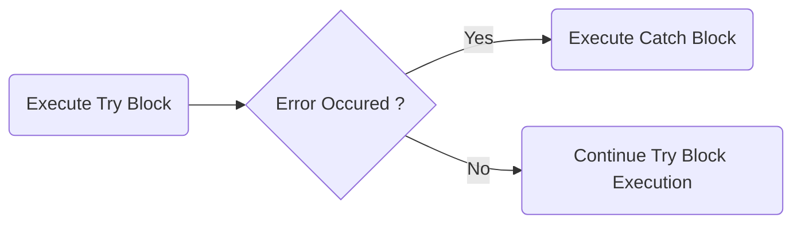

# Gérer les erreurs

En Powershell, il existe deux types d'erreur:

`Non-Terminating`
:    Une erreur est émise mais le reste du code continu à s'éxécuter.

`Terminating`
:   Une erreur sera émise et l'éxécution du code sera arrété immédiatement.

La variable `$ErrorActionPreference` et le paramètre `-ErrorAction` permettent de changer le comportement de votre code en cas d'erreur `Non-Terminating`. Ils peuvent prendre les valeurs suivantes :

Continue
:   Emet une erreur et continue l'exécution (valeur par défaut)

SilentlyContinue
:   N'émet aucun message d'erreur et continue l'éxécution. Impossible à "catcher" dans le code.

Ignore
:   Supprime le message et continue l'éxécution. Dans le cas de `-ErrorActionPreference`, n'alimente pas la variable `$Error`. Impossible à "catcher" dans le code.

Inquire
:   Emet un message d'erreur et demande confirmation avant de continuer l'éxécution.

Stop
:   Affiche le message et stoppe l'éxécution.  **C'est ce comportement que nous pourrons catcher dans le code**.


!!!warning
Supprimer l'ensemble des erreurs dans son script en configurant `$ErrorActionPreference = "SilentlyContinue"` au début de son script est une mauvaise habitude à ne pas prendre.
!!!

Dans le cas où nous configurons `ErrorAction = Stop` sans gérer l'erreur, une seule erreur arrête toute l'exécution. Dans une boucle, **les itérations suivantes ne seront jamais exécutées**.

Dans cet exemple, si un seul des groupes est introuvable, la boucle s'arrête et les groupes suivants ne sont jamais interrogés :

```powershell #5
$GroupIds = '<id-groupe-1>', '00000000-0000-0000-0000-000000000000', '<id-groupe-2>'
foreach ($GroupId in $GroupIds)
{
    Write-Verbose "Querying group $GroupId"
    Get-MgGroup -GroupId $GroupId -Property Id, DisplayName, GroupTypes -ErrorAction Stop
}
```

## Try / Catch

Pour gérer et catcher les erreurs `Terminating`, il convient de les utiliser au sein d'un block `Try/Catch`.

Dans cet exemple, on contrôle la date d'expiration des secrets de plusieurs *App Registrations*. Une application introuvable ne bloque plus le traitement des suivantes :

+++ :icon-code: Code

```powershell #13-23
$AppObjectIds = '3987ed1e-0f3a-4abd-8cb1-774549292f00', '00000000-0000-0000-0000-000000000000'

foreach ($AppObjectId in $AppObjectIds)
{
    Write-Verbose "Querying application $AppObjectId"

    $Params = @{
        ApplicationId = $AppObjectId
        Property      = 'DisplayName', 'PasswordCredentials'
        ErrorAction   = 'Stop'
    }

    try {
        $App = Get-MgApplication @Params
        [PSCustomObject]@{
            Application = $App.DisplayName
            Secrets     = $App.PasswordCredentials.Count
            NextExpiry  = $App.PasswordCredentials.EndDateTime | Sort-Object | Select-Object -First 1
        }
    }
    catch {
        Write-Warning "A problem occurred when querying application $AppObjectId : $($_.Exception.Message)"
    }
}
```

+++ :icon-note: Output

```txt
WARNING: A problem occurred when querying application 00000000-0000-0000-0000-000000000000 : Resource '00000000-0000-0000-0000-000000000000' does not exist or one of its queried reference-property objects are not present.

Application          Secrets NextExpiry
-----------          ------- ----------
Formation-PowerShell       1 02/04/2027 07:12:45
```

+++

!!!warning
`-ApplicationId` attend l'**ID d'objet** de l'application, et non son **ID d'application (client)**. Pour rechercher par Client ID : `Get-MgApplication -Filter "appId eq '<client-id>'"`.
!!!


```mermaid
graph LR
    A(Execute Try Block) --> B{Error Occured ?}
    B -->|Yes| D(Execute Catch Block)
    B -->|No| E(Continue Try Block Execution) 
```

!!!
Dans un bloc `catch`, la variable [!badge variant="danger" text="$_"] correspond à l'erreur (`ErrorRecord`) qui a déclenché son exécution. Son message est accessible via `$_.Exception.Message`.
!!!

### Catcher par type d'exception

Il est possible de renseigner plusieurs blocs `catch` en définissant pour chacun le type d'exception qui le déclenchera.

Ici, sur un inventaire des appareils Entra, on distingue un **module manquant** (le SDK Graph est découpé en sous-modules, `Get-MgDevice` fait partie de `Microsoft.Graph.Identity.DirectoryManagement`) d'une erreur renvoyée par l'API :

+++ :icon-code: Code

```powershell #10,15
$DeviceIds = '08f83af9-0655-4434-b59f-31cce73c2eec', '00000000-0000-0000-0000-000000000000'

foreach ($DeviceId in $DeviceIds)
{
    try
    {
        Get-MgDevice -DeviceId $DeviceId -ErrorAction Stop |
            Select-Object DisplayName, OperatingSystem, ApproximateLastSignInDateTime
    }
    catch [Request_ResourceNotFound,Microsoft.Graph.PowerShell.Cmdlets.GetMgDevice_Get]
    {
        Write-Warning "Le module Microsoft.Graph.Identity.DirectoryManagement n'est pas installé"
        break
    }
    catch
    {
        Write-Warning "Device $DeviceId : $($_.Exception.Message)"
    }
}
```

+++ :icon-note: Output (module absent)

```txt
WARNING: Le module Microsoft.Graph.Identity.DirectoryManagement n'est pas installé
```

+++ :icon-note: Output (module présent)

```txt
DisplayName OperatingSystem ApproximateLastSignInDateTime
----------- --------------- -----------------------------
WKS-PARIS-01 Windows        28/09/2026 08:41:12
WARNING: Device 00000000-0000-0000-0000-000000000000 : Resource '00000000-0000-0000-0000-000000000000' does not exist or one of its queried reference-property objects are not present.
```

+++

!!! Pour identifier une erreur :

Juste après avoir rencontré l'erreur, exécuter :

```powershell
$Error[0].Exception.GetType().FullName   # Type de l'exception
$Error[0].FullyQualifiedErrorId          # Identifiant de l'erreur
```

**Pour rappel :** [!badge variant="danger" text="$Error"] contient toutes les erreurs de la session, de la plus récente à la plus ancienne. `$Error[0]` renvoie donc la dernière erreur rencontrée.
!!!

### Catcher une erreur Graph par son code

Les erreurs renvoyées par l'API Graph n'ont pas de type .NET spécifique : elles sont toutes de type `System.Exception`, un `catch [type]` ne permet donc pas de les distinguer. On les identifie par leur **code d'erreur Graph**, repris au début de `FullyQualifiedErrorId` (`Request_ResourceNotFound`, `Authorization_RequestDenied`, `Request_BadRequest`...) :

```txt
PS > Get-MgGroup -GroupId 00000000-0000-0000-0000-000000000000 -ErrorAction SilentlyContinue
PS > $Error[0].Exception.GetType().FullName
System.Exception
PS > $Error[0].FullyQualifiedErrorId
Request_ResourceNotFound,Microsoft.Graph.PowerShell.Cmdlets.GetMgGroup_Get
```

Ici, on ajoute une liste de membres à un groupe en traitant chaque cas différemment :

+++ :icon-code: Code

```powershell #13,14
$GroupId   = '<id-groupe>'
$MemberIds = '<id-user-1>', '<id-user-deja-membre>', '00000000-0000-0000-0000-000000000000'

foreach ($MemberId in $MemberIds)
{
    try
    {
        New-MgGroupMember -GroupId $GroupId -DirectoryObjectId $MemberId -ErrorAction Stop
        Write-Verbose "$MemberId ajouté au groupe" -Verbose
    }
    catch
    {
        $GraphError = $_
        switch -Wildcard ($GraphError.FullyQualifiedErrorId)
        {
            'Request_ResourceNotFound*'    { Write-Warning "$MemberId introuvable dans l'annuaire" }
            'Authorization_RequestDenied*' { throw "Permissions insuffisantes sur le groupe $GroupId" }
            'Request_BadRequest*'
            {
                if ($GraphError.Exception.Message -match 'already exist') { Write-Warning "$MemberId est déjà membre du groupe" }
                else { Write-Warning "Requête invalide : $($GraphError.Exception.Message)" }
            }
            default                        { Write-Warning "Erreur inattendue : $($GraphError.Exception.Message)" }
        }
    }
}
```

+++ :icon-note: Output

```txt
VERBOSE: <id-user-1> ajouté au groupe
WARNING: <id-user-deja-membre> est déjà membre du groupe
WARNING: 00000000-0000-0000-0000-000000000000 introuvable dans l'annuaire
```

+++

!!!warning Piège
Dans un bloc `switch`, [!badge variant="danger" text="$_"] désigne la valeur testée par le `switch`, **et non plus l'erreur**. Il faut donc sauvegarder l'erreur dans une variable (`$GraphError = $_`) avant d'entrer dans le `switch`.
!!!

## Bloc Finally

Il est possible d'ajouter à un `Try/Catch` le bloc `Finally`. Celui-ci s'exécutera à la fin du Try/Catch, que des erreurs aient été rencontrées ou non.

C'est l'endroit idéal pour libérer une ressource, par exemple **fermer la session Graph**, même si le script a échoué :

+++ :icon-code: Code

```powershell #10-14
try
{
    Connect-MgGraph -TenantId $TenantId -ClientSecretCredential $Credential -NoWelcome -ErrorAction Stop
    Get-MgDomain -ErrorAction Stop | Select-Object Id, IsDefault, IsVerified
}
catch
{
    Write-Error "Échec de l'inventaire des domaines : $($_.Exception.Message)"
}
finally
{
    Disconnect-MgGraph -ErrorAction SilentlyContinue | Out-Null
    Write-Verbose 'Session Graph fermée' -Verbose
}
```

+++ :icon-note: Output

```txt
Id                               IsDefault IsVerified
--                               --------- ----------
SynapsysTest.onmicrosoft.com          True       True
VERBOSE: Session Graph fermée
```

+++
