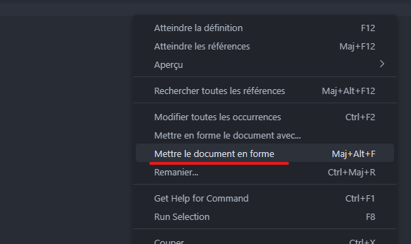

# Les Guidelines

{.list-icon}
- #### :icon-check: On commente son code (mais pas trop !)

Inutile de décrire vos actions, c'est détailler la raison pour laquelle un bout de code est présent qui importe.

{.list-icon}
- #### :icon-check: Jamais d'alias ou de paramètre implicite dans votre code

Utilisez les alias et épargnez vous de taper les paramètres dans votre terminal, **mais jamais dans votre code !**

+++ :icon-thumbsdown: Pas Bien

```powershell
gci c:\temp
```

+++ :icon-thumbsup: Bien

```powershell
Get-ChildItem -Path "c:\temp"
```

+++

{.list-icon}
- #### :icon-check: Respecter la convention `Verb-Noun` dans le nommage de vos fonctions.


{.list-icon}
- #### :icon-check: Evitez autant que possible l'utlisation de "Write-Host"
  

{.list-icon}
- #### :icon-check: Nommez vos variables de manière à rendre leurs contenu explicite

Par convention, on utilisera le PascalCase pour le nommage : `$MaVariable`

{.list-icon}
- #### :icon-check: On respecte l'indentation

+++ :icon-thumbsdown: Pas Bien

```powershell
function Get-ComputerStatus
{
[CmdletBinding()]
param (
[string[]]$ComputerName)

Write-Verbose "Start $($MyInvocation.MyCommand)"

foreach ($Computer in $ComputerName)
{
Write-Verbose "Querying $Computer"
Write-Debug "[$Computer]Debug Message "
            <# Votre Code #>
} 
   Write-Verbose "End $($MyInvocation.MyCommand)"
    
}
```

+++ :icon-thumbsup: Bien

```powershell
function Get-ComputerStatus
{
    [CmdletBinding()]
    param (
        [string[]]$ComputerName
    )

    Write-Verbose "Start $($MyInvocation.MyCommand)"

    foreach ($Computer in $ComputerName)
    {
        Write-Verbose "Querying $Computer"
        Write-Debug "[$Computer]Debug Message "
        <# Votre Code #>
    } 
    
    Write-Verbose "End $($MyInvocation.MyCommand)"
    
}
```

+++

!!!
 Dans VSCode, **Clic Droit** > **Mettre le document en forme**


!!!
