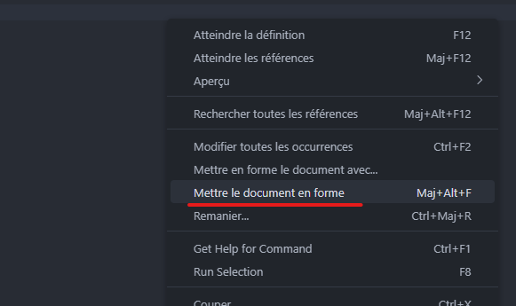

# Les Guidelines

{.list-icon}
- #### :icon-check: On commente son code (mais pas trop !)

Inutile de décrire ce que fait le code : il se lit tout seul. Ce qui importe, c'est d'expliquer **pourquoi** un bout de code est là.

+++ :icon-thumbsdown: Pas Bien

```powershell
# Récupère les utilisateurs
$Users = Get-MgUser -All -Filter "endswith(mail,'@SynapsysTest.onmicrosoft.com')" -ConsistencyLevel eventual -CountVariable UserCount
```

+++ :icon-thumbsup: Bien

```powershell
# endswith() est une "requête avancée" Graph : elle exige -ConsistencyLevel eventual ET -CountVariable
$Users = Get-MgUser -All -Filter "endswith(mail,'@SynapsysTest.onmicrosoft.com')" -ConsistencyLevel eventual -CountVariable UserCount
```

+++

{.list-icon}
- #### :icon-check: Jamais d'alias ni de paramètre implicite dans votre code

Utilisez les alias et épargnez-vous la saisie des noms de paramètres dans votre terminal, **mais jamais dans votre code !**

+++ :icon-thumbsdown: Pas Bien

```powershell
Get-MgServicePrincipal -All -Filter "accountEnabled eq false" | sort DisplayName | select DisplayName, AppId
```

+++ :icon-thumbsup: Bien

```powershell
Get-MgServicePrincipal -All -Filter "accountEnabled eq false" |
    Sort-Object -Property DisplayName |
    Select-Object -Property DisplayName, AppId
```

+++

{.list-icon}
- #### :icon-check: Filtrez à gauche

Avec Microsoft Graph, chaque objet renvoyé transite par le réseau. Filtrez **côté serveur** avec `-Filter` et ne demandez que les propriétés utiles avec `-Property`, plutôt que de tout récupérer pour trier ensuite avec `Where-Object`.

+++ :icon-thumbsdown: Pas Bien

```powershell
Get-MgGroup -All | Where-Object -Property DisplayName -Like 'GRP-*'
```

+++ :icon-thumbsup: Bien

```powershell
Get-MgGroup -All -Filter "startswith(displayName,'GRP-')" -Property Id, DisplayName
```

+++

{.list-icon}
- #### :icon-check: Respectez la convention `Verbe-Nom` pour nommer vos fonctions

Le verbe doit faire partie des verbes approuvés (`Get-Verb`), et le nom doit être **au singulier**. Ajoutez un **préfixe** au nom pour éviter les collisions avec des commandes existantes.

+++ :icon-thumbsdown: Pas Bien

```powershell
function CheckAppSecrets { }   # Pas de tiret, "Check" n'est pas un verbe approuvé
function Get-Secrets { }       # Pluriel, et trop proche de Get-Secret (module SecretManagement)
```

+++ :icon-thumbsup: Bien

```powershell
function Get-CustomAppSecret { }  # Verbe approuvé, nom au singulier, préfixe "Custom"
```

+++

!!!
`Get-Verb -Verb Check` ne renvoie rien : ce verbe n'est pas approuvé. À l'import d'un module, PowerShell affiche un avertissement pour chaque fonction exportée qui utilise un verbe non approuvé.
!!!

{.list-icon}
- #### :icon-check: Évitez autant que possible l'utilisation de `Write-Host`

`Write-Host` écrit à l'écran, pas dans le pipeline : son résultat ne peut être ni filtré, ni trié, ni exporté. Renvoyez des **objets**, et utilisez `Write-Verbose` ou `Write-Information` pour les messages.

+++ :icon-thumbsdown: Pas Bien

```powershell
foreach ($App in $Apps)
{
    Write-Host "$($App.DisplayName) : $($App.PasswordCredentials.Count) secret(s)"
}
```

+++ :icon-thumbsup: Bien

```powershell
foreach ($App in $Apps)
{
    [PSCustomObject]@{
        Application = $App.DisplayName
        Secrets     = $App.PasswordCredentials.Count
    }
}
```

+++

{.list-icon}
- #### :icon-check: Nommez vos variables de manière à rendre leur contenu explicite

Par convention, on utilise le PascalCase : `$MaVariable`. Une collection porte un nom au pluriel, l'élément de la boucle le même nom au singulier.

+++ :icon-thumbsdown: Pas Bien

```powershell
$r = Get-MgDirectoryRole -All
foreach ($x in $r)
{
    $m = Get-MgDirectoryRoleMember -DirectoryRoleId $x.Id
}
```

+++ :icon-thumbsup: Bien

```powershell
$DirectoryRoles = Get-MgDirectoryRole -All
foreach ($DirectoryRole in $DirectoryRoles)
{
    $RoleMembers = Get-MgDirectoryRoleMember -DirectoryRoleId $DirectoryRole.Id
}
```

+++

{.list-icon}
- #### :icon-check: Jamais de secret en clair dans votre code

Un script finit toujours par être partagé, copié ou versionné dans Git. Un secret d'App Registration écrit en dur est un secret compromis.

+++ :icon-thumbsdown: Pas Bien

```powershell
$Secret     = ConvertTo-SecureString -String 'Abc8Q~xYz123...' -AsPlainText -Force
$Credential = [pscredential]::new($ClientId, $Secret)
Connect-MgGraph -TenantId $TenantId -ClientSecretCredential $Credential
```

+++ :icon-thumbsup: Bien

```powershell
# Option 1 : certificat installé dans le magasin de l'utilisateur
Connect-MgGraph -TenantId $TenantId -ClientId $ClientId -CertificateThumbprint $Thumbprint

# Option 2 : secret stocké dans un coffre (module Microsoft.PowerShell.SecretManagement)
$Secret     = Get-Secret -Name 'Graph-Formation'
$Credential = [pscredential]::new($ClientId, $Secret)
Connect-MgGraph -TenantId $TenantId -ClientSecretCredential $Credential
```

+++

{.list-icon}
- #### :icon-check: On respecte l'indentation

+++ :icon-thumbsdown: Pas Bien

```powershell
function Get-DeviceActivity
{
[CmdletBinding()]
param (
[ValidateRange(1, 365)]
[int]$DaysInactive = 90)

Write-Verbose "Start $($MyInvocation.MyCommand)"
$Devices = Get-MgDevice -All -Property DisplayName, OperatingSystem, ApproximateLastSignInDateTime
foreach ($Device in $Devices)
{
Write-Verbose "Processing $($Device.DisplayName)"
        if ($Device.ApproximateLastSignInDateTime) {
$InactiveDays = ((Get-Date) - $Device.ApproximateLastSignInDateTime).Days }
else { $InactiveDays = $null }
  [PSCustomObject]@{
DisplayName     = $Device.DisplayName
    OperatingSystem = $Device.OperatingSystem
InactiveDays    = $InactiveDays
        Stale           = ($null -eq $InactiveDays) -or ($InactiveDays -ge $DaysInactive)
}
    }
   Write-Verbose "End $($MyInvocation.MyCommand)"
}
```

+++ :icon-thumbsup: Bien

```powershell
function Get-DeviceActivity
{
    [CmdletBinding()]
    param (
        [ValidateRange(1, 365)]
        [int]$DaysInactive = 90
    )

    Write-Verbose "Start $($MyInvocation.MyCommand)"

    $Devices = Get-MgDevice -All -Property DisplayName, OperatingSystem, ApproximateLastSignInDateTime

    foreach ($Device in $Devices)
    {
        Write-Verbose "Processing $($Device.DisplayName)"

        if ($Device.ApproximateLastSignInDateTime)
        {
            $InactiveDays = ((Get-Date) - $Device.ApproximateLastSignInDateTime).Days
        }
        else
        {
            $InactiveDays = $null
        }

        [PSCustomObject]@{
            DisplayName     = $Device.DisplayName
            OperatingSystem = $Device.OperatingSystem
            InactiveDays    = $InactiveDays
            Stale           = ($null -eq $InactiveDays) -or ($InactiveDays -ge $DaysInactive)
        }
    }

    Write-Verbose "End $($MyInvocation.MyCommand)"
}
```

+++

!!!
Dans VSCode, **Clic droit** > **Mettre le document en forme** (ou `Maj+Alt+F`)


!!!
